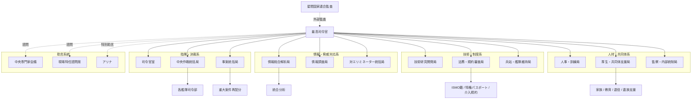
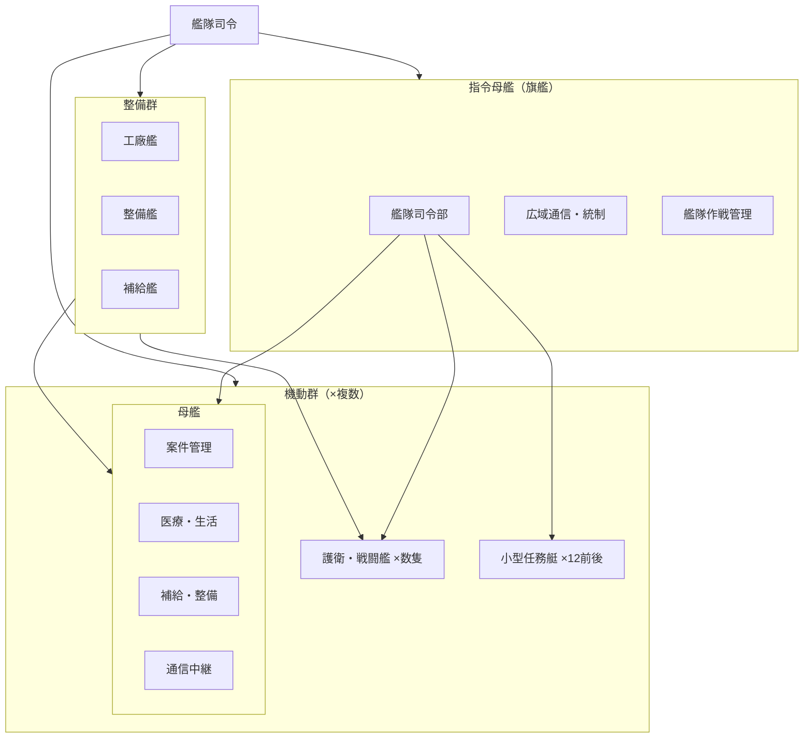
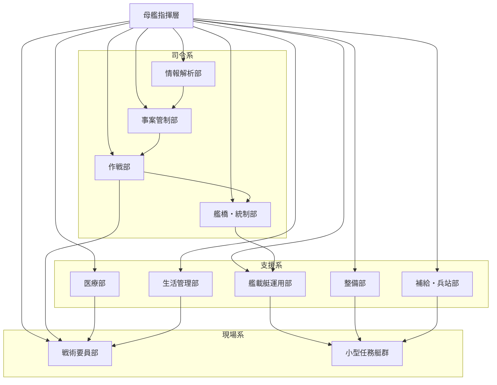

# 星間治安維持機構（ISMO）図解

## 管理メタ

- 基準時点: 現代
- 公知度: 作者用整理
- 主な認知層: 作者
- 真偽: 現行設定
- 変動性: 高
- 時点依存: 高
- 例外的認知者:

## 注記

- 現時点の設定を視覚化した整理用図解
- 役職名や階級体系は未確定部分があるため、まずは構造と責任範囲の見取り図を優先する
- 細部は今後の議論で更新する前提

## 中枢部組織図

## 艦隊編成図

## 母艦内部署図

## 読み方メモ

- `中枢部組織図` は、最高司令官直下で何がぶら下がるかを見る図
- `艦隊編成図` は、旗艦、機動群、整備群の三層を見る図
- `母艦内部署図` は、母艦が `動く基地` としてどう回るかを見る図
- 今後 `役職・階級体系` が固まったら、この図の各ノードへ肩書を追記できる
